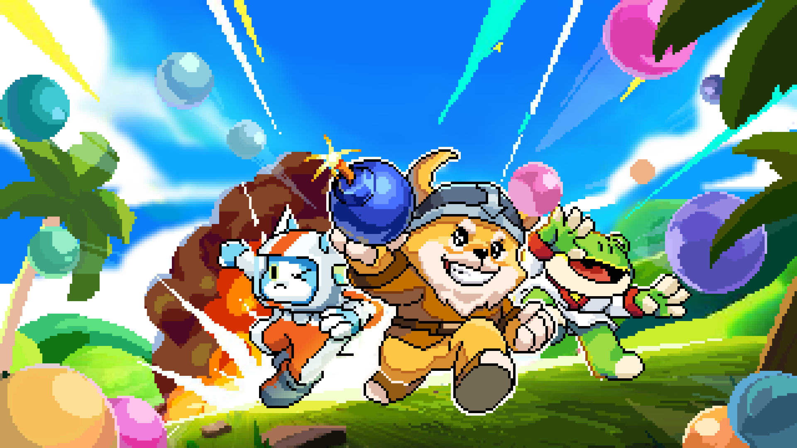

# Introduction

### **Enter the Explosive Battleground of Bomb Pixel**

Born from the fusion of **classic arcade nostalgia** and **cutting-edge Web3 innovation**, **Bomb Pixel** is more than just a game - it's a battlefield where strategy, skill, and adaptation determine your survival.&#x20;

In **Bomb Pixel**, warriors deploy their arsenal in **dynamic, unpredictable battlegrounds**. **Strategic bomb placement, hero progression, land ownership, and a player-driven economy** weave together a world where the strongest minds and the quickest reflexes claim victory. Whether you're a **casual explorer seeking chaos** or a **hardened tactician climbing the ranks**, **every match is a test of wits, courage, and explosive mastery**.

<figure><figcaption></figcaption></figure>

#### **A World Forged by Players, for Players**

The world of **Bomb Pixel** is a living entity, ever-evolving with its **players at the helm**. It is built upon **blockchain-powered innovation**, ensuring **true asset ownership, transparent progression, and a decentralized economy**.

* Key Pillars of Bomb Pixel’s Universe:\
  🔥 Play-to-Earn Dominance – Only the sharpest minds and the boldest players will carve their legacy, earning rewards through skill, strategy, and participation.\
  💥 On-Chain Progression – Your achievements are eternal, etched into the blockchain, ensuring your triumphs, victories, and progression remain immutable.\
  ⚔️ Social-Fi Warfare – Glory is never a solo endeavor—join the ranks, rise through the leaderboards, and forge your reputation in a player-driven social battlefield.\
  🌍 Seamless Interoperability – No boundaries. No limits. Play across platforms, battle anywhere, and claim dominance across multiple realms.

But Bomb Pixel is more than just a game. It’s a movement. A revolution. A new frontier in Web3 gaming. As we push the boundaries of what’s possible, players will not just play but shape the very world they fight in.

This is your battleground. Your war. Your legacy.\
The bombs are primed. The arena awaits.

Will you rise - or will you be reduced to rubble? 🚀💣

