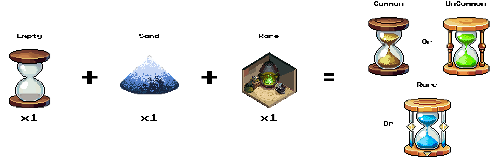

# How to craft Hourglass?

1. [**Workshop**](../workshops.md) **Rarity Restriction**

A **Workshop can only craft Hourglasses of equal or lower rarity**.

> A **Rare Workshop** can craft **Common, Uncommon, and Rare Hourglasses** but **not Epic or higher**.

2. **Two Crafting Methods**

* **Upgrade by Combining 3 Hourglasses**
  * To craft an **Hourglass of higher rarity**, players need **three Hourglasses of the same lower rarity**.
  * Additionally, they must own a **Workshop with a rarity equal to the target Hourglass**.
  * Hourglasses must be **fully charged** and **not currently equipped**.
  * **On-chain transaction required** to complete the crafting process.


3 Rare Hourglasses + 1 Epic Workshop = 1 Epic Hourglass


<figure><figcaption></figcaption></figure>

**Craft from Materials**

* Requires **1 Empty Hourglass + Sand + Workshop**.
* The resulting Hourglass rarity is random but will be **equal to or lower than the Workshop rarity**.


Using **1 Empty Hourglass + 1 Sand + Rare Workshop**, players can obtain a **Common, Uncommon, or Rare Hourglass randomly.**


<figure><figcaption></figcaption></figure>

* **Empty Hourglass** is obtained from:
  * **Final boss chest rewards (Boss Challenge Mode)**
  * **Bomb Pass rewards**
* **Sand** is obtained from:
  * **Bomb Pass rewards**
  * **Purchasable Sand packs in-game**

#### **Sand Cost for Crafting Hourglasses**

| Rarity    | Sand Required |
| --------- | ------------- |
| Common    | 200           |
| Uncommon  | 300           |
| Rare      | 500           |
| Epic      | 700           |
| Legendary | 1200          |
| Mythic    | 1700          |
| Unique    | 2800          |

Players must **sign an on-chain transaction** to complete crafting.
