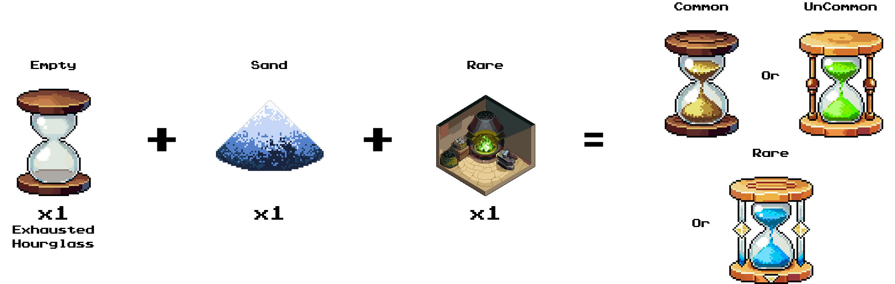

# How to recharge Hourglass?

#### **Recharge Mechanics**

* **Only exhausted Hourglasses can be recharged.**
* Players use **Sand** to recharge an Hourglass.
* Workshop rarity can fully recharge Hourglasses of equal or lower rarity.
* Players need to sign an **on-chain transaction** for recharging.


Sand + Exhausted Hourglass + Rare Workshop = Full Rare/Common/Uncommon Hourglass


<figure><figcaption></figcaption></figure>

#### **Sand Cost for Recharging**

| Rarity    | Sand Required |
| --------- | ------------- |
| Common    | 300           |
| Uncommon  | 600           |
| Rare      | 900           |
| Epic      | 1200          |
| Legendary | 1500          |
| Mythic    | 1800          |
| Unique    | 2100          |
