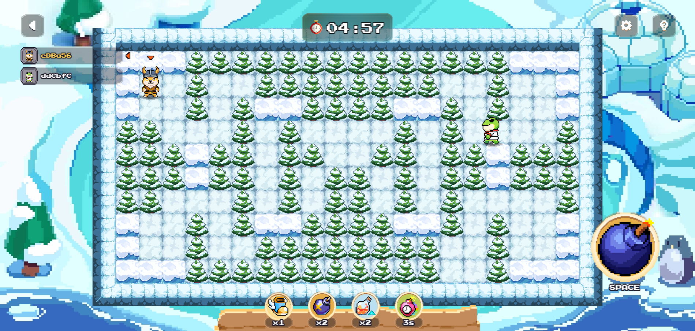

# Normal Game (PvP)

* Type: Classic PvP
* Objective: Be the last player standing by eliminating opponents through strategic bomb placement.
* Gameplay: Compete in grid-based arenas with destructible environments.
* Rewards: Winners will receive points, which are used for ranking on the leaderboard. At the end of the season, top-ranking players will receive an airdrop.

<figure><figcaption></figcaption></figure>
